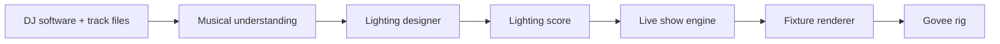

<div align="center">

# AutoLight

**An automated lighting designer for DJs — Rekordbox + Serato in, Govee RGBIC out.**

[](https://github.com/carterlasalle/autolight/actions/workflows/ci.yml)


[Quick start](#quick-start) · [How it works](#how-it-works) · [Follow modes](#follow-modes) · [Packages](#architecture) · [Contributing](CONTRIBUTING.md) · [Security](SECURITY.md)

</div>

AutoLight is a local-first show-control engine for DJs. It reads which tracks are loaded on each deck, understands the DJ software's actual beatgrid, analyzes the whole song before performance, and generates a coherent lighting score for the entire track — the way a lighting designer would program it, not the way an audio visualizer flashes at bass.

## How it works



The application knows the whole song before the song plays. If a drop lands on beat 257, the engine knows it at beat 225 — so builds progress intentionally, darkness lands before impact, palettes evolve across phrases, and second drops vary from first drops.

| Principle | What it means |
|---|---|
| Future knowledge first | Whole-song plans from complete analysis, not beat-by-beat reactions |
| DJ beatgrid is timing truth | Rekordbox/Serato grids win; ML trackers only vote confidence |
| Analysis describes, planner directs | No DSP function can fire `STROBE()` directly |
| Lighting is hierarchical | Track → section → phrase → bar → beat → sub-beat decisions |
| Darkness is a state | Blackouts, negative space, and delayed reveals are programmed, not idle |
| Repetition needs purpose | Choruses repeat their visual language; randomness never does |

## Follow modes

No controller board is required in any mode. Transport comes from DJ software, never from the FLX4.

| Mode | Source | Accuracy | Needs |
|---|---|---|---|
| `preview` (default) | ANLZ grid + compiled plan | Beat-anchored, intro cursor | Nothing — works offline |
| `ax-beat` | Rekordbox screen time fields | Coarse (~1 Hz, ±1 beat) | Rekordbox open |
| `prolink` | PRO DJ LINK Virtual-CDJ capture | Beat-accurate | Link peer on the LAN |
| `soundswitch` | Lighting IPC capture | Sample-accurate | SoundSwitch 2.11+, Rekordbox 7.2.19+ |

Set it in Setup → DJ source. The UI shows honest empty states (`-- BPM`, `No show loaded`, `No lights`) until real decks, analysis, and discovered lights resolve — never mock tracks.

## Quick start

### Prerequisites

- Node.js `22` (see `package.json` engines)
- Yarn `4.9.2` (`packageManager` field)
- Python `3.12+` with [`uv`](https://docs.astral.sh/uv/)
- FFmpeg on `PATH`

```bash
git clone https://github.com/carterlasalle/autolight.git
cd autolight
yarn install --immutable
yarn build
yarn test
```

Run the Python analysis suite:

```bash
cd analysis && uv sync && uv run pytest
```

### Run the desktop app

```bash
cd apps/desktop
yarn dev        # Vite renderer at http://localhost:5173
```

Build all three Electron contexts (Vite renderer + esbuild main/preload):

```bash
yarn build
```

Then launch `dist/electron/main.cjs` with Electron. The app is local-first and offline-capable during performances: playback continues if the analysis worker crashes, and the renderer never blocks the show loop.

## Capabilities

| Area | What AutoLight provides |
|---|---|
| DJ sources | Rekordbox library (read-only SQLCipher + WAL), ANLZ grids/phrases/cues/waveforms, Serato crates + Remote transport, FLX4 MIDI as secondary truth |
| Analysis | Python worker over framed-JSON stdio; native ANLZ wins timing, all-in-one + beat_this vote structure, stem DSP finds builds/drops/fake drops |
| Planning | Deterministic seeded plans (same track + style → same show), section contrast, motif recurrence, restraint + impact budgets |
| Runtime | Random-access show cursor, seek/loop/scratch handling, two-deck audible-weight mixing, fault-degraded clock that never cuts to black on one drop |
| Rendering | Venue-independent cues → per-fixture RGB frames, linear-light intensity, per-device latency compensation, newest-state-wins streams |
| Hardware | Govee H6076 + H1A45 over LAN (discovery → arm → stream), per-device FPS backoff, disconnect/reconnect re-arm, qualification wizard |
| UI | Electron + React + Tailwind v4 + shadcn/Radix; Live/Library/Inspector/Venue/Setup/Diagnostics; ⌘K palette; no-modal Live guarantees |

## Architecture

A Yarn workspace with deliberately narrow package boundaries:

```text
apps/
  desktop/                Electron shell (Vite renderer, esbuild main/preload)
packages/
  contracts/              Zod schemas: TrackModel, ShowPlan, DeckState, fixtures
  rekordbox-library/      Read-only library + ANLZ path math + phrase labels
  rekordbox-live/         Lighting/IPC + composite-FLX4 providers, replay harness
  serato/                 Crate parser + Remote snapshot → DeckState
  controller-flx4/        FLX4 MIDI map; hints only, never playhead
  track-model/            Canonical identity (native ID → path → hash → fingerprint)
  analysis-client/        Framed-JSON stdio bridge to the Python worker
  show-planner/           Deterministic whole-song lighting scores
  show-runtime/           Cursor, clock health, overrides, resume quantization
  show-mixer/             Two-deck blending + exclusive impact ownership
  renderer/               Plan + beat + fixtures → logical RGB frames
  venue/                  Shared coordinates, groups, orientation, qualification
  govee/                  LAN opcodes, coalescing, DeviceManager, calibration
  reactive-audio/         Controlled overlay (brightness/sparkle only, ≤20%)
  storage/                SQLite WAL cache with per-table version invalidation
  simulator/              Deterministic deck/fixture/fault harnesses for tests
  diagnostics/            Structured logs, metrics, session recorder
analysis/
  src/autolight_analysis/ Native ANLZ, DSP features, fusion, worker
protocol-fixtures/        Committed Lighting/IPC captures for replay tests
test-fixtures/analysis/   Real TrackModel/ShowPlan fixtures from the ANLZ cache
```

Timing truth flows one way: DJ beatgrid → beats (never seconds) → plan → cursor → mixer → renderer → transport. Analysis evidence never bypasses the planner, and live audio never restructures the show.

## Safety model

- Rekordbox database access is **read-only**, always.
- Blackout is RGB `0,0,0` — the stream stays armed, power is never cycled mid-show.
- One dropped packet never kills the rig: extrapolate → hold look → degraded clock.
- Emergency BLACKOUT is a toolbar button with a keyboard shortcut, never behind a modal.
- Unknown Rekordbox versions probe but are never declared supported until replay qualification passes.

The normative requirements are in [`docs/SPEC.MD`](docs/SPEC.MD). Architecture boundaries are in [`docs/architecture.md`](docs/architecture.md). Protocol work is logged in [`docs/rekordbox-capture.md`](docs/rekordbox-capture.md).

## Documentation

| Document | Purpose |
|---|---|
| [Specification](docs/SPEC.MD) | Full product/engineering contract (§1–§150) |
| [Architecture](docs/architecture.md) | Boundaries and timing-truth flow |
| [Rekordbox capture](docs/rekordbox-capture.md) | Lighting IPC capture matrix + live log |
| [Show planner](docs/show-planner.md) | Planning model |
| [Track model](docs/track-model.md) | Identity + coverage levels |
| [Govee](docs/govee.md) | LAN transport |
| [Qualification](docs/qualification.md) | Device qualification |
| [Contributing](CONTRIBUTING.md) | Development workflow and PR standards |
| [Agent guidance](AGENTS.md) | Repository-specific rules for coding agents |

## Contributing

Direct pushes to `main` are blocked; all changes land through pull requests with required checks. Read [CONTRIBUTING.md](CONTRIBUTING.md) before making changes. Run `yarn verify:phase1` before requesting review.
